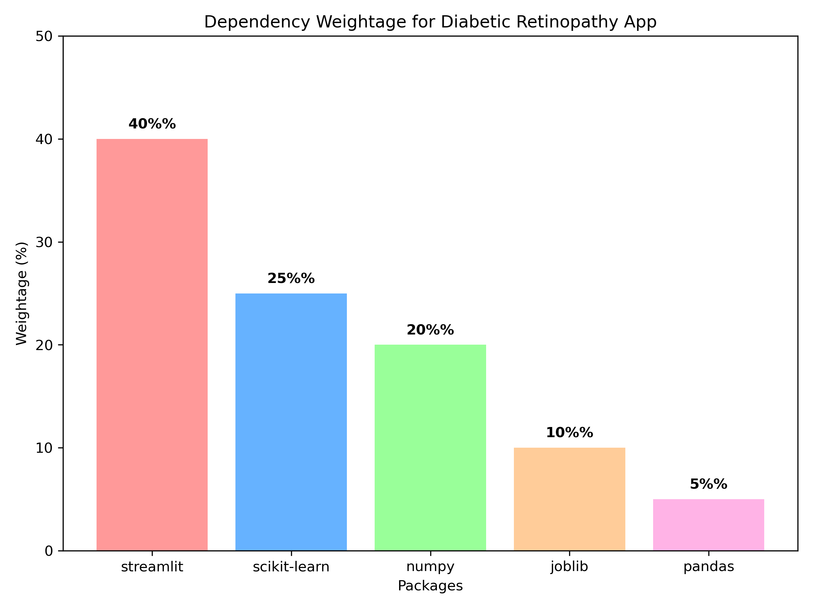

# Diabetic Retinopathy Prediction Streamlit App 
 
This project deploys a logistic regression model to predict diabetic retinopathy. The app includes editable inputs and a dependency weightage visualization. 
 
## Project Structure 
- `app.py`: Streamlit app script. 
- `logistic_model.pkl`: Trained logistic regression model. 
- `scaler.pkl`: StandardScaler for input standardization. 
- `requirements.txt`: Python dependencies. 
- `dependency_weightage.png`: Visualization of dependency importance. 
- `README.md`: Project documentation. 
 
## Setup Instructions 
### Local Deployment 
1. Navigate to the project directory: 
   ```bash 
   cd C:\Users\artik\diabetic-retinopathy-streamlit 
   ``` 
2. Activate Conda environment: 
   ```bash 
   conda activate streamlit_env 
   ``` 
3. Install dependencies: 
   ```bash 
   pip install -r requirements.txt 
   ``` 
4. Run the Streamlit app: 
   ```bash 
   streamlit run app.py 
   ``` 
5. Open `http://localhost:8501` in a browser. 
 
### Streamlit Community Cloud Deployment 
1. Push to GitHub: 
   ```bash 
   git init 
   git add . 
   git commit -m "Initial commit" 
   git branch -M main 
   git remote add origin https://github.com/artikasingh880/artikasingh880-diabetic-retinopathy-streamlit.git 
   git push -u origin main 
   ``` 
2. Deploy via [Streamlit Community Cloud](https://streamlit.io/cloud), selecting `app.py` as the main script. 
 
## Model Details 
- **Algorithm**: Logistic Regression 
- **Accuracy**: 77%% 
- **AUC Score**: 0.768 
- **Input Features**: Age (35-103), Systolic BP (69-151), Diastolic BP (62-133), Cholesterol (69-148) 
 
## Dependency Weightage 
- streamlit: 40%% (Web app interface) 
- scikit-learn: 25%% (Model loading and prediction) 
- numpy: 20%% (Numerical operations) 
- joblib: 10%% (Model file loading) 
- pandas: 5%% (Optional data handling) 
 
 
 
## Author 
- Artika Singh 
